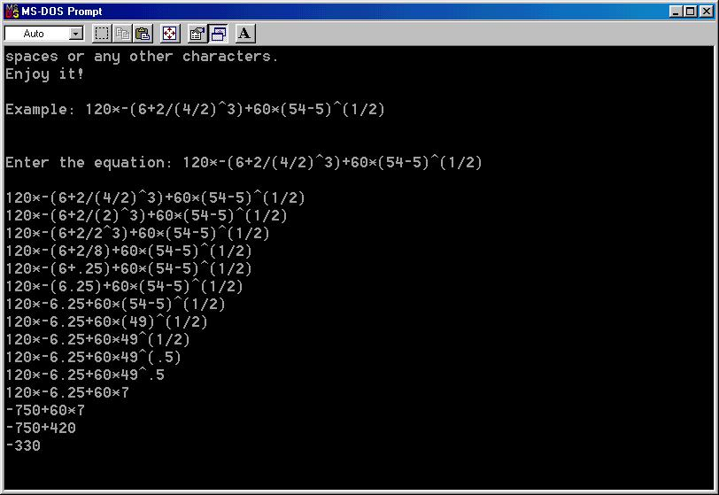

<div align="center">

## Equation Calculator


</div>

### Description

This is a QuickBasic program, but I thought it might be useful in your VB projects. It calculates any given numeric equation.
 
### More Info
 
In DOS, it will ask you to give any numeric equation containing parentheses, power, multiplication, division, addition, subtraction, and/or negation. Check the screen shot to see an example.

You can add it in your VB project, and just pass the equation to the program.

In DOS, it will print out each step of solving your equation according to the priority of the operations (check out the screen shot).

If you add it in your VB project, you can change it so that it returns an array of the steps or a final answer only.

Like any other program, it has limits as a calculator. Do not try to have a number with an exponent. Do not use 3(4-5), instead, use 3*(4-5).


<span>             |<span>
---                |---
**Submitted On**   |
**By**             |[E P](https://github.com/Planet-Source-Code/PSCIndex/blob/master/ByAuthor/e-p.md)
**Level**          |Intermediate
**User Rating**    |5.0 (10 globes from 2 users)
**Compatibility**  |VB 3\.0, VB 4\.0 \(16\-bit\), VB 4\.0 \(32\-bit\), VB 5\.0, VB 6\.0
**Category**       |[Math/ Dates](https://github.com/Planet-Source-Code/PSCIndex/blob/master/ByCategory/math-dates__1-37.md)
**World**          |[Visual Basic](https://github.com/Planet-Source-Code/PSCIndex/blob/master/ByWorld/visual-basic.md)
**Archive File**   |[](https://github.com/Planet-Source-Code/e-p-equation-calculator__1-22261/archive/master.zip)


### Source Code

```
CLS
ON ERROR GOTO ending
t1$ = "Equation Calculator 2.3.5"
t2$ = "By ePuter"
LOCATE 1, 40 - LEN(t1$) / 2: PRINT t1$
LOCATE 2, 40 - LEN(t2$) / 2: PRINT t2$
PRINT
PRINT " Welcome! The program allows you"
PRINT "to enter any equation containing"
PRINT "a parentheses ( or ), power as ^"
PRINT "*, /, +, -, ., and/or a negation"
PRINT "and will give you a step-by-step"
PRINT "solution according to the prior-"
PRINT "ity of the operations."
PRINT " The program will not understand"
PRINT "spaces or any other characters."
PRINT "Enjoy it!"
PRINT : PRINT "Example: 120*-(6+2/(4/2)^3)+60*(54-5)^(1/2)"
PRINT : PRINT
INPUT "Enter the equation: ", maineqzn$
PRINT
PRINT maineqzn$
power = 0
multiply = 1
divide = 2
add = 3
subtract = 4
DO
  p = 1
  DO
    c1 = INSTR(p, maineqzn$, "(")
    IF c1 = 0 THEN eqzn$ = maineqzn$: EXIT DO
    c2 = INSTR(c1 + 1, maineqzn$, "(")
    c3 = INSTR(maineqzn$, ")")
    IF c3 < c2 OR c2 = 0 THEN eqzn$ = MID$(maineqzn$, c1 + 1, c3 - c1 - 1): EXIT DO ELSE p = c1 + 1
  LOOP
  DO
    IF INSTR(eqzn$, "E") <> 0 THEN EXIT DO
    a = INSTR(eqzn$, "^"): opr = power
    IF a = 0 THEN a = INSTR(eqzn$, "*"): opr = multiply
    IF a = 0 THEN a = INSTR(eqzn$, "/"): opr = divide
    IF a = 0 THEN a = INSTR(eqzn$, "+"): opr = add
    IF a = 0 THEN a = INSTR(eqzn$, "-"): opr = subtract
    IF a = 1 THEN
      a = INSTR(a + 1, eqzn$, "-"): IF a = 0 THEN EXIT DO
    END IF
    IF a = 0 THEN EXIT DO
    i1 = a - 1
    DO
repeat1:
      i1 = i1 - 1
      IF i1 <= 0 THEN i1 = 0: GOTO found1
      b$ = MID$(eqzn$, i1, 1)
      SELECT CASE VAL(b$)
        CASE 1 TO 9: GOTO repeat1
        CASE 0:
          SELECT CASE b$
            CASE ".": GOTO repeat1
            CASE "0": GOTO repeat1
            CASE "-": i1 = i1 - 1: GOTO found1
            CASE ELSE: GOTO found1
          END SELECT
      END SELECT
    LOOP
found1:
    i1 = i1 + 1
    num1 = VAL(MID$(eqzn$, i1, a - i1))
    i2 = a + 1
    DO
repeat2:
      i2 = i2 + 1
      IF i2 >= LEN(eqzn$) THEN i2 = LEN(eqzn$) + 1: GOTO found2
      b$ = MID$(eqzn$, i2, 1)
      SELECT CASE VAL(b$)
        CASE 1 TO 9: GOTO repeat2
        CASE 0:
          SELECT CASE b$
            CASE ".": GOTO repeat2
            CASE "0": GOTO repeat2
            CASE ELSE: GOTO found2
          END SELECT
      END SELECT
    LOOP
found2:
    i2 = i2 - 1
    num2 = VAL(MID$(eqzn$, a + 1, i2 - a))
    SELECT CASE opr
      CASE power: num = num1 ^ num2
      CASE multiply: num = num1 * num2
      CASE divide:
        IF num2 = 0 THEN PRINT : PRINT "Warning: Division by zero.": END ELSE num = num1 / num2
      CASE add: num = num1 + num2
      CASE subtract: num = num1 - num2
    END SELECT
    IF num >= 0 THEN
      num$ = MID$(STR$(num), 2)
    ELSE
      num$ = STR$(num)
    END IF
    IF num1 < 0 THEN
      IF num >= 0 AND i1 > 1 THEN num$ = "+" + num$
    END IF
    eqzn$ = LEFT$(eqzn$, i1 - 1) + num$ + RIGHT$(eqzn$, LEN(eqzn$) - i2)
    IF c1 = 0 THEN
      PRINT eqzn$
    ELSE
      PRINT LEFT$(maineqzn$, c1) + eqzn$ + RIGHT$(maineqzn$, LEN(maineqzn$) - c3 + 1)
    END IF
    IF num < 0 THEN
      IF eqzn$ = STR$(num) THEN EXIT DO
    ELSE
      IF eqzn$ = MID$(STR$(num), 2) THEN EXIT DO
    END IF
  LOOP
  IF c1 <> 0 THEN
    maineqzn$ = LEFT$(maineqzn$, c1 - 1) + eqzn$ + RIGHT$(maineqzn$, LEN(maineqzn$) - c3)
    PRINT maineqzn$
  END IF
LOOP UNTIL c1 = 0
END
ending:
PRINT : PRINT "Warning: Syntax error or overflow.": END
```

